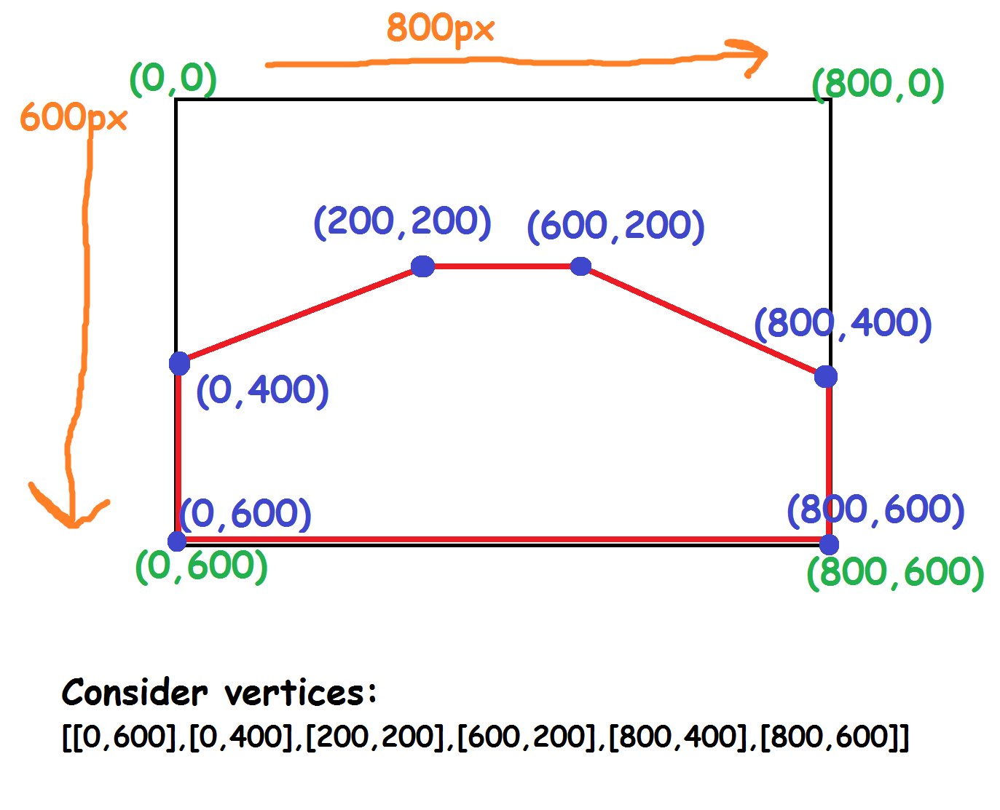
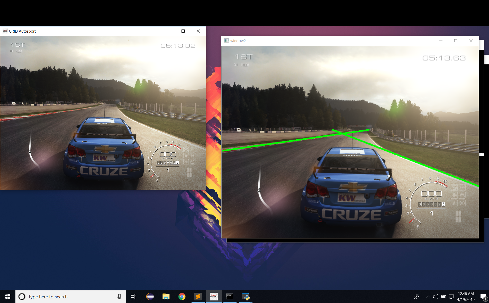
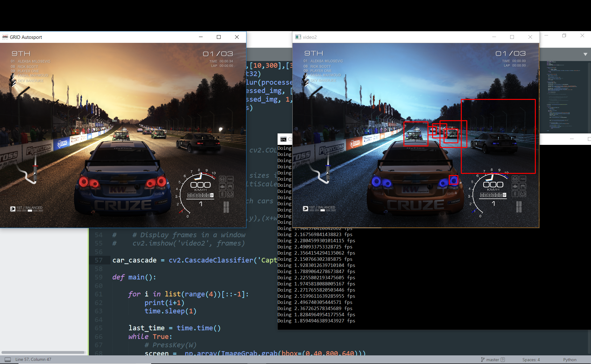
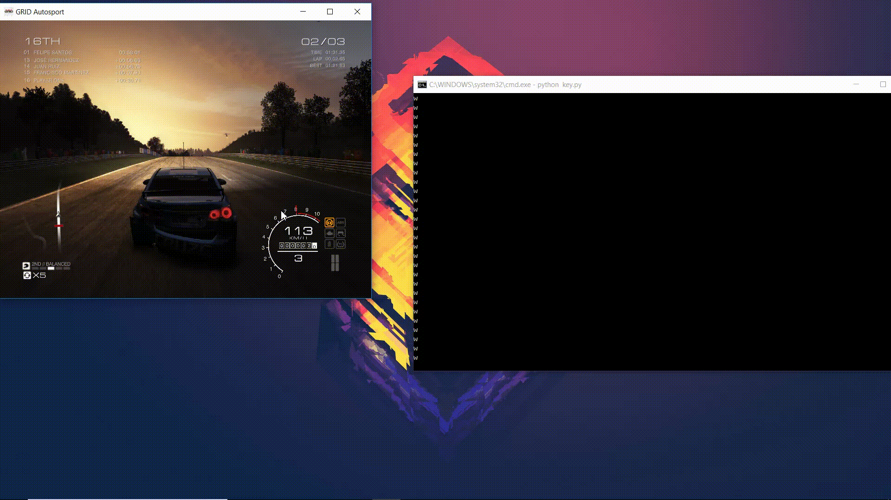

# Self-Driving-AI
A trial at creating a automated self driving bot for GRID Autosport

We started by Capturing the original frames from the game itself:
## Image Capture

***

Furthermore, from the extracted image we had to find the edges, so we implemented edge detection in the retrieved frame as well.
## Edge Detection

***

We do not need all the frame so in order to remove the sky and unnecessary parts, we took out only the below half in shape of a trapezium like in this image.
## Region of Interest

***

## Hough Lines
From this image using Hough Transform we get these lines that detect the sides of the road and depending on the angle of these lines we can get the car to move in a basic algorithm.
- Left line have a positive angle and right line have a negative angle: Go straight (Key W)
- Both lines have positive angle : Go right (Key D)
- Both lines have negative angle : Go left (Key A)

***

## Car Detection
Now inorder to control car in a suitable way, we can use a Haar Classifier to detect cars as we will need that data to use braking and collision avoidance, also the size of the formed rectangle can help us know the distance of the car infront from us and also can deem a car with rectangle bigger than certain size to be too close and apply braking.

***

## Final Rundown and result
Now with all this data we can either run the code with trivial algorithm, or use a machine learning to transform and export the data to a csv which can be further used to control the car in a better way. This gif shows the car being controlled by our program. 
<em>Control code will be uploaded soon</em>

